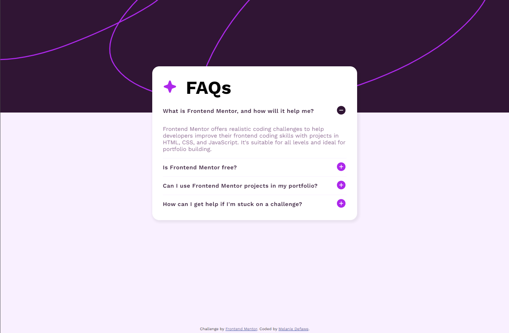

# Frontend Mentor - FAQ accordion solution

This is a solution to the [FAQ accordion challenge on Frontend Mentor](https://www.frontendmentor.io/challenges/faq-accordion-wyfFdeBwBz). Frontend Mentor challenges help you improve your coding skills by building realistic projects. 

## Table of contents

- [Overview](#overview)
  - [The challenge](#the-challenge)
  - [Screenshot](#screenshot)
  - [Links](#links)
- [My process](#my-process)
  - [What I learned](#what-i-learned)
  - [Useful resources](#useful-resources)
- [Author](#author)

## Overview

### The challenge

Users should be able to:

- Hide/Show the answer to a question when the question is clicked
- Navigate the questions and hide/show answers using keyboard navigation alone
- View the optimal layout for the interface depending on their device's screen size
- See hover and focus states for all interactive elements on the page

### Screenshot

### Links

- [Live Solution URL](https://fementor-faq.netlify.app/)

## My process

### What I learned

The main purpose of this challenge was to get acquainted with setting up my own solo projects, using GitHub and pushing projects live.

I have been working for 1.5 years as a Frontend developer, working in a pretty specific environment where I am not using GitHub. I felt quite rusty with such workflows, so I thought it was time to refresh my memory. I somehow messed up my initial commit, which reminded me that I should first and foremost create a new repository before getting into the nitty-gritty of the code.

The other purpose is to simply "get out there", show my code to more people, and receive more feedback. I especially want to make sure I'm continuously building good practices in my coding.

I did not encounter many difficulties with the challenge in itself and strived to get as close to the mock-up as possible.

### Useful resources

- [Adjusting SVG to full view width](https://stackoverflow.com/questions/9185434/using-svg-as-background-image) - This helped me understand how to make sure my svg element would take the whole width page, and not keep a max width of 1440px. 

## Author

- Frontend Mentor - [@melaniedefawe](https://www.frontendmentor.io/profile/melaniedefawe)
